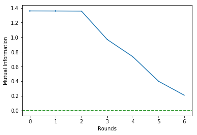
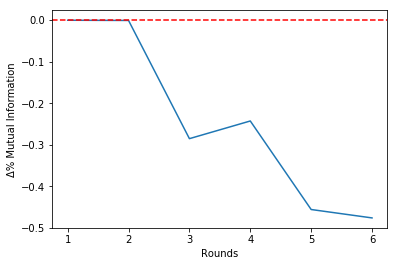
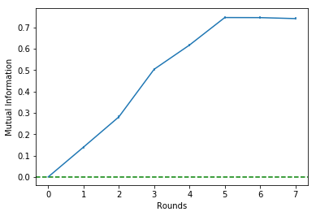

# ***InfoSel*** - A Python package that makes feature/variable selection for supervised learning tasks using Mutual Information


### *Felipe Maia Polo (felipemaiapolo), Felipe Leno da Silva (f-leno)*


## 1\. Introduction 

In this package we implement the ideas proposed by [1, 2] in order to make variable/feature selection prior to regression and classification tasks using Gaussian Mixture Models (GMMs) to estimate the Mutual Information between labels and features. This is an efficient and well-performing alternative and was used in a recent work [3] by one of us.

If you use our package in your research, you can cite it as follows:

    @misc{polo2020infosel,
        author={Polo, Felipe Maia and Da Silva, Felipe Leno},
        title = {InfoSel - A Python package that makes feature/variable selection for supervised learning tasks using Mutual Information},
        year = {2020},
        publisher = {GitHub},
        journal = {GitHub repository},
        howpublished = {\url{https://github.com/felipemaiapolo/infosel}},
    }


--------------

## 2\. Installing *InfoSel* 

You can install the package from
[GitHub](https://github.com/felipemaiapolo/infosel).

``` :sh
$ pip install git+https://github.com/felipemaiapolo/infosel.git#egg=infosel
```
--------------------

## 3\. Example of *InfoSel* use

Loading Packages:


```python
import infosel as inf
import numpy as np  
import pandas as pd
import matplotlib.pyplot as plt
```

### 3.1\. Dataset

We generate a dataset  sampled from  similar to the one in [here](https://www.cs.toronto.edu/~delve/data/add10/desc.html), in which  is given by

<br>

<br>

Where  and  independent from all the other random variables for all . See that our target variable does not depende on the last two features. In the following we set `n=10000`:


```python
def f(X,e): return 10*np.sin(np.pi*X[:,0]*X[:,1]) + 20*(X[:,2]-.5)**2 + 10*X[:,3] + 5*X[:,4] + e
```


```python
n=10000
d=7

X = np.random.uniform(0,1,d*n).reshape((n,d))
e = np.random.normal(0,1,n)
y = f(X,e)

X.shape, y.shape
```


    ((10000, 7), (10000,))


### 3.2\. Selecting Features for a Regression Task

Training (and validating) GMM:


```python
%%time

gmm = inf.get_gmm(X, y, max_comp=10)
```

    Wall time: 8.43 s
    

Ordering features by their importances using the *Backward Elimination* algorithm:


```python
select = inf.SelectVars(gmm, selection_mode = 'backward')
select.fit(X, y, verbose=True)    
```

    Let's start...
    
    Round =   0   |   Î =  1.36   |   Δ%Î =  0.00   |   Features=[0, 1, 2, 3, 4, 5, 6]
    Round =   1   |   Î =  1.36   |   Δ%Î = -0.00   |   Features=[0, 1, 2, 3, 4, 5]
    Round =   2   |   Î =  1.36   |   Δ%Î = -0.00   |   Features=[0, 1, 2, 3, 4]
    Round =   3   |   Î =  0.97   |   Δ%Î = -0.29   |   Features=[0, 1, 3, 4]
    Round =   4   |   Î =  0.73   |   Δ%Î = -0.24   |   Features=[0, 1, 3]
    Round =   5   |   Î =  0.40   |   Δ%Î = -0.46   |   Features=[0, 3]
    Round =   6   |   Î =  0.21   |   Δ%Î = -0.48   |   Features=[3]
    

Checking history:


```python
select.get_info()
```


<div>
<table border="1" class="dataframe">
  <thead>
    <tr style="text-align: right;">
      <th></th>
      <th>rounds</th>
      <th>mi_mean</th>
      <th>mi_error</th>
      <th>delta</th>
      <th>num_feat</th>
      <th>features</th>
    </tr>
  </thead>
  <tbody>
    <tr>
      <th>0</th>
      <td>0</td>
      <td>1.358832</td>
      <td>0.008771</td>
      <td>0.000000</td>
      <td>7</td>
      <td>[0, 1, 2, 3, 4, 5, 6]</td>
    </tr>
    <tr>
      <th>1</th>
      <td>1</td>
      <td>1.358090</td>
      <td>0.008757</td>
      <td>-0.000546</td>
      <td>6</td>
      <td>[0, 1, 2, 3, 4, 5]</td>
    </tr>
    <tr>
      <th>2</th>
      <td>2</td>
      <td>1.356661</td>
      <td>0.008753</td>
      <td>-0.001053</td>
      <td>5</td>
      <td>[0, 1, 2, 3, 4]</td>
    </tr>
    <tr>
      <th>3</th>
      <td>3</td>
      <td>0.969897</td>
      <td>0.007843</td>
      <td>-0.285085</td>
      <td>4</td>
      <td>[0, 1, 3, 4]</td>
    </tr>
    <tr>
      <th>4</th>
      <td>4</td>
      <td>0.734578</td>
      <td>0.007396</td>
      <td>-0.242622</td>
      <td>3</td>
      <td>[0, 1, 3]</td>
    </tr>
    <tr>
      <th>5</th>
      <td>5</td>
      <td>0.400070</td>
      <td>0.007192</td>
      <td>-0.455375</td>
      <td>2</td>
      <td>[0, 3]</td>
    </tr>
    <tr>
      <th>6</th>
      <td>6</td>
      <td>0.209808</td>
      <td>0.005429</td>
      <td>-0.475571</td>
      <td>1</td>
      <td>[3]</td>
    </tr>
  </tbody>
</table>
</div>


It is possible to see that the estimated mutual information is untouched until Round 2, when it varies around -$30\%$.

Since there is a 'break' in Round 2, we should choose to stop the algorithm at theta round. This will be clear in the Mutual Information history plot that follows:


```python
select.plot_mi()
```





Plotting the percentual variations of the mutual information between rounds:


```python
select.plot_delta()
```





Making the selection choosing to stop at Round 2:


```python
X_new = select.transform(X, rd=2)

X_new.shape
```


    (10000, 5)


### 3.3\. Selecting Features for a Classification Task

Categorizing $Y$:


```python
ind0 = (y<np.percentile(y, 33))
ind1 = (np.percentile(y, 33)<=y) & (y<np.percentile(y, 66))
ind2 = (np.percentile(y, 66)<=y)

y[ind0] = 0
y[ind1] = 1
y[ind2] = 2

y=y.astype(int)
```


```python
y[:15]
```


    array([2, 0, 1, 2, 0, 2, 0, 0, 0, 1, 2, 1, 0, 0, 2])


Training (and validating) GMMs:


```python
%%time 

gmm=inf.get_gmm(X, y, y_cat=True, max_comp=10)
```

    Wall time: 6.7 s
    

Ordering features by their importances using the *Backward Elimination* algorithm:


```python
select=inf.SelectVars(gmm, selection_mode='forward')
select.fit(X, y, verbose=True)    
```

    Let's start...
    
    Round =   0   |   Î =  0.00   |   Δ%Î =  0.00   |   Features=[]
    Round =   1   |   Î =  0.14   |   Δ%Î =  0.00   |   Features=[3]
    Round =   2   |   Î =  0.28   |   Δ%Î =  1.01   |   Features=[3, 0]
    Round =   3   |   Î =  0.50   |   Δ%Î =  0.79   |   Features=[3, 0, 1]
    Round =   4   |   Î =  0.62   |   Δ%Î =  0.22   |   Features=[3, 0, 1, 4]
    Round =   5   |   Î =  0.75   |   Δ%Î =  0.21   |   Features=[3, 0, 1, 4, 2]
    Round =   6   |   Î =  0.75   |   Δ%Î = -0.00   |   Features=[3, 0, 1, 4, 2, 5]
    Round =   7   |   Î =  0.74   |   Δ%Î = -0.01   |   Features=[3, 0, 1, 4, 2, 5, 6]
    

Checking history:


```python
select.get_info()
```


<div>
<table border="1" class="dataframe">
  <thead>
    <tr style="text-align: right;">
      <th></th>
      <th>rounds</th>
      <th>mi_mean</th>
      <th>mi_error</th>
      <th>delta</th>
      <th>num_feat</th>
      <th>features</th>
    </tr>
  </thead>
  <tbody>
    <tr>
      <th>0</th>
      <td>0</td>
      <td>0.000000</td>
      <td>0.000000</td>
      <td>0.000000</td>
      <td>0</td>
      <td>[]</td>
    </tr>
    <tr>
      <th>1</th>
      <td>1</td>
      <td>0.139542</td>
      <td>0.005217</td>
      <td>0.000000</td>
      <td>1</td>
      <td>[3]</td>
    </tr>
    <tr>
      <th>2</th>
      <td>2</td>
      <td>0.280835</td>
      <td>0.006377</td>
      <td>1.012542</td>
      <td>2</td>
      <td>[3, 0]</td>
    </tr>
    <tr>
      <th>3</th>
      <td>3</td>
      <td>0.503872</td>
      <td>0.006499</td>
      <td>0.794196</td>
      <td>3</td>
      <td>[3, 0, 1]</td>
    </tr>
    <tr>
      <th>4</th>
      <td>4</td>
      <td>0.617048</td>
      <td>0.006322</td>
      <td>0.224612</td>
      <td>4</td>
      <td>[3, 0, 1, 4]</td>
    </tr>
    <tr>
      <th>5</th>
      <td>5</td>
      <td>0.745933</td>
      <td>0.005135</td>
      <td>0.208874</td>
      <td>5</td>
      <td>[3, 0, 1, 4, 2]</td>
    </tr>
    <tr>
      <th>6</th>
      <td>6</td>
      <td>0.745549</td>
      <td>0.005202</td>
      <td>-0.000515</td>
      <td>6</td>
      <td>[3, 0, 1, 4, 2, 5]</td>
    </tr>
    <tr>
      <th>7</th>
      <td>7</td>
      <td>0.740968</td>
      <td>0.005457</td>
      <td>-0.006144</td>
      <td>7</td>
      <td>[3, 0, 1, 4, 2, 5, 6]</td>
    </tr>
  </tbody>
</table>
</div>


It is possible to see that the estimated mutual information is untouched from Round 6 onwards.

Since there is a 'break' in Round 5, we should choose to stop the algorithm at theta round. This will be clear in the Mutual Information history plot that follows:


```python
select.plot_mi()
```





Plotting the percentual variations of the mutual information between rounds:


```python
select.plot_delta()
```


Making the selection choosing to stop at Round 5:


```python
X_new = select.transform(X, rd=5)

X_new.shape
```


    (10000, 5)
    
--------------
## 4\. Reference

[1] Eirola, E., Lendasse, A., & Karhunen, J. (2014, July). Variable selection for regression problems using Gaussian mixture models to estimate mutual information. In 2014 International Joint Conference on Neural Networks (IJCNN) (pp. 1606-1613). IEEE.

[2] Lan, T., Erdogmus, D., Ozertem, U., & Huang, Y. (2006, July). Estimating mutual information using gaussian mixture model for feature ranking and selection. In The 2006 IEEE International Joint Conference on Neural Network Proceedings (pp. 5034-5039). IEEE.

[3] Polo, F. M., & Vicente, R. (2020). Covariate Shift Adaptation in High-Dimensional and Divergent Distributions. arXiv preprint arXiv:2010.01184.


