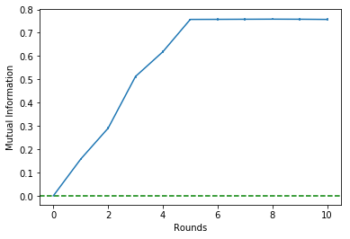
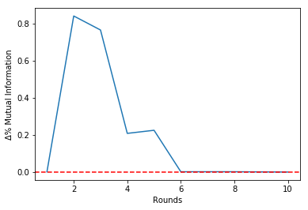

# *InfoSel*: A Python package that makes feature/variable selection for supervised learning tasks using Mutual Information.


### *Felipe Maia Polo (felipemaiapolo), Felipe Leno da Silva (f-leno)*

------------------------------------------

## 0\. Installing *InfoSel* and Loading other Packages

Installing package:


```python
!pip install git+https://github.com/felipemaiapolo/infosel.git#egg=infosel
```

    Requirement already satisfied: infosel from git+https://github.com/felipemaiapolo/infosel.git#egg=infosel in c:\users\felipe\appdata\local\programs\python\python35\lib\site-packages (1.0.0)
    Requirement already satisfied: numpy in c:\users\felipe\appdata\local\programs\python\python35\lib\site-packages (from infosel) (1.18.5)
    Requirement already satisfied: scipy in c:\users\felipe\appdata\local\programs\python\python35\lib\site-packages (from infosel) (1.4.1)
    Requirement already satisfied: matplotlib in c:\users\felipe\appdata\local\programs\python\python35\lib\site-packages (from infosel) (3.0.3)
    Requirement already satisfied: sklearn in c:\users\felipe\appdata\local\programs\python\python35\lib\site-packages (from infosel) (0.0)
    Requirement already satisfied: pandas in c:\users\felipe\appdata\local\programs\python\python35\lib\site-packages (from infosel) (0.24.2)
    Requirement already satisfied: python-dateutil>=2.1 in c:\users\felipe\appdata\local\programs\python\python35\lib\site-packages (from matplotlib->infosel) (2.8.1)
    Requirement already satisfied: cycler>=0.10 in c:\users\felipe\appdata\local\programs\python\python35\lib\site-packages (from matplotlib->infosel) (0.10.0)
    Requirement already satisfied: kiwisolver>=1.0.1 in c:\users\felipe\appdata\local\programs\python\python35\lib\site-packages (from matplotlib->infosel) (1.1.0)
    Requirement already satisfied: pyparsing!=2.0.4,!=2.1.2,!=2.1.6,>=2.0.1 in c:\users\felipe\appdata\local\programs\python\python35\lib\site-packages (from matplotlib->infosel) (2.4.7)
    Requirement already satisfied: scikit-learn in c:\users\felipe\appdata\local\programs\python\python35\lib\site-packages (from sklearn->infosel) (0.22.2.post1)
    Requirement already satisfied: pytz>=2011k in c:\users\felipe\appdata\local\programs\python\python35\lib\site-packages (from pandas->infosel) (2020.1)
    Requirement already satisfied: six>=1.5 in c:\users\felipe\appdata\local\programs\python\python35\lib\site-packages (from python-dateutil>=2.1->matplotlib->infosel) (1.15.0)
    Requirement already satisfied: setuptools in c:\users\felipe\appdata\local\programs\python\python35\lib\site-packages (from kiwisolver>=1.0.1->matplotlib->infosel) (50.3.2)
    Requirement already satisfied: joblib>=0.11 in c:\users\felipe\appdata\local\programs\python\python35\lib\site-packages (from scikit-learn->sklearn->infosel) (0.14.1)
    

    DEPRECATION: Python 3.5 reached the end of its life on September 13th, 2020. Please upgrade your Python as Python 3.5 is no longer maintained. pip 21.0 will drop support for Python 3.5 in January 2021. pip 21.0 will remove support for this functionality.
    WARNING: You are using pip version 20.2.3; however, version 20.2.4 is available.
    You should consider upgrading via the 'c:\users\felipe\appdata\local\programs\python\python35\python.exe -m pip install --upgrade pip' command.
    

Loading Packages:


```python
import infosel as inf
import numpy as np  
import pandas as pd
import matplotlib.pyplot as plt
```

## 1\. Example of *InfoSel* use

**Feature selection** filter techniques help us to decide which features we should

### 1.1\. Dataset

We generate a dataset $D$ sampled from $\mathcal{D}=\{(X_{0,i},...,X_{14,i},Y_i)\}_{i=1}^{n}$ similar to the one in [here](https://www.cs.toronto.edu/~delve/data/add10/desc.html), in which $Y_i$ is given by

\begin{equation}
Y_i =10\cdot \sin(\pi X_{0,i}  X_{1,i}) + 20 (X_{2,i}-0.5)^2 + 10 X_{3,i} + 5 X_{4,i} + \epsilon_i
\end{equation}

Where $X_{0,i},...,X_{14,i} \overset{iid}{\sim} U[0,1]$ and $\epsilon_i \sim N(0,1)$ independent from all the other random variables for all $i\in [n]$. In the following we set $n=10000$:


```python
def f(X,e): return 10*np.sin(np.pi*X[:,0]*X[:,1]) + 20*(X[:,2]-.5)**2 + 10*X[:,3] + 5*X[:,4] + e
```


```python
n=10000

X = np.random.uniform(0,1,15*n).reshape((n,15))
e = np.random.normal(0,1,n)
y = f(X,e)

X.shape, y.shape
```


    ((10000, 15), (10000,))


### 1.2\. Selecting Features for a Regression Task

Training (and validating) GMM:


```python
%%time

gmm = inf.get_gmm(X, y, max_comp=10)
```

    Wall time: 15.2 s
    

Ordering features by their importances using the *Backward Elimination* algorithm:


```python
select = inf.SelectVars(gmm, selection_mode = 'backward')
select.fit(X, y, verbose=True)    
```

    Let's start...
    
    Round =   0   |   Î =  1.39   |   Δ%Î =  0.00   |   Features=[0, 1, 2, 3, 4, 5, 6, 7, 8, 9, 10, 11, 12, 13, 14]
    Round =   1   |   Î =  1.39   |   Δ%Î = -0.00   |   Features=[0, 1, 2, 3, 4, 6, 7, 8, 9, 10, 11, 12, 13, 14]
    Round =   2   |   Î =  1.39   |   Δ%Î = -0.00   |   Features=[0, 1, 2, 3, 4, 6, 7, 8, 10, 11, 12, 13, 14]
    Round =   3   |   Î =  1.39   |   Δ%Î = -0.00   |   Features=[0, 1, 2, 3, 4, 6, 7, 8, 10, 11, 12, 14]
    Round =   4   |   Î =  1.39   |   Δ%Î = -0.00   |   Features=[0, 1, 2, 3, 4, 6, 8, 10, 11, 12, 14]
    Round =   5   |   Î =  1.39   |   Δ%Î = -0.00   |   Features=[0, 1, 2, 3, 4, 6, 10, 11, 12, 14]
    Round =   6   |   Î =  1.39   |   Δ%Î = -0.00   |   Features=[0, 1, 2, 3, 4, 10, 11, 12, 14]
    Round =   7   |   Î =  1.38   |   Δ%Î = -0.00   |   Features=[0, 1, 2, 3, 4, 11, 12, 14]
    Round =   8   |   Î =  1.38   |   Δ%Î = -0.00   |   Features=[0, 1, 2, 3, 4, 11, 14]
    Round =   9   |   Î =  1.38   |   Δ%Î = -0.00   |   Features=[0, 1, 2, 3, 4, 11]
    Round =  10   |   Î =  1.38   |   Δ%Î = -0.00   |   Features=[0, 1, 2, 3, 4]
    Round =  11   |   Î =  0.98   |   Δ%Î = -0.29   |   Features=[0, 1, 3, 4]
    Round =  12   |   Î =  0.74   |   Δ%Î = -0.24   |   Features=[0, 1, 3]
    Round =  13   |   Î =  0.39   |   Δ%Î = -0.47   |   Features=[0, 3]
    Round =  14   |   Î =  0.21   |   Δ%Î = -0.47   |   Features=[3]
    

Checking history:


```python
select.get_info()
```


<div>
<style scoped>
    .dataframe tbody tr th:only-of-type {
        vertical-align: middle;
    }

    .dataframe tbody tr th {
        vertical-align: top;
    }

    .dataframe thead th {
        text-align: right;
    }
</style>
<table border="1" class="dataframe">
  <thead>
    <tr style="text-align: right;">
      <th></th>
      <th>rounds</th>
      <th>mi_mean</th>
      <th>mi_error</th>
      <th>delta</th>
      <th>num_feat</th>
      <th>features</th>
    </tr>
  </thead>
  <tbody>
    <tr>
      <th>0</th>
      <td>0</td>
      <td>1.392524</td>
      <td>0.008824</td>
      <td>0.000000</td>
      <td>15</td>
      <td>[0, 1, 2, 3, 4, 5, 6, 7, 8, 9, 10, 11, 12, 13,...</td>
    </tr>
    <tr>
      <th>1</th>
      <td>1</td>
      <td>1.391535</td>
      <td>0.008813</td>
      <td>-0.000710</td>
      <td>14</td>
      <td>[0, 1, 2, 3, 4, 6, 7, 8, 9, 10, 11, 12, 13, 14]</td>
    </tr>
    <tr>
      <th>2</th>
      <td>2</td>
      <td>1.390415</td>
      <td>0.008777</td>
      <td>-0.000805</td>
      <td>13</td>
      <td>[0, 1, 2, 3, 4, 6, 7, 8, 10, 11, 12, 13, 14]</td>
    </tr>
    <tr>
      <th>3</th>
      <td>3</td>
      <td>1.389277</td>
      <td>0.008775</td>
      <td>-0.000819</td>
      <td>12</td>
      <td>[0, 1, 2, 3, 4, 6, 7, 8, 10, 11, 12, 14]</td>
    </tr>
    <tr>
      <th>4</th>
      <td>4</td>
      <td>1.388291</td>
      <td>0.008763</td>
      <td>-0.000710</td>
      <td>11</td>
      <td>[0, 1, 2, 3, 4, 6, 8, 10, 11, 12, 14]</td>
    </tr>
    <tr>
      <th>5</th>
      <td>5</td>
      <td>1.387176</td>
      <td>0.008752</td>
      <td>-0.000803</td>
      <td>10</td>
      <td>[0, 1, 2, 3, 4, 6, 10, 11, 12, 14]</td>
    </tr>
    <tr>
      <th>6</th>
      <td>6</td>
      <td>1.386056</td>
      <td>0.008741</td>
      <td>-0.000807</td>
      <td>9</td>
      <td>[0, 1, 2, 3, 4, 10, 11, 12, 14]</td>
    </tr>
    <tr>
      <th>7</th>
      <td>7</td>
      <td>1.384795</td>
      <td>0.008733</td>
      <td>-0.000910</td>
      <td>8</td>
      <td>[0, 1, 2, 3, 4, 11, 12, 14]</td>
    </tr>
    <tr>
      <th>8</th>
      <td>8</td>
      <td>1.383664</td>
      <td>0.008720</td>
      <td>-0.000817</td>
      <td>7</td>
      <td>[0, 1, 2, 3, 4, 11, 14]</td>
    </tr>
    <tr>
      <th>9</th>
      <td>9</td>
      <td>1.382456</td>
      <td>0.008722</td>
      <td>-0.000873</td>
      <td>6</td>
      <td>[0, 1, 2, 3, 4, 11]</td>
    </tr>
    <tr>
      <th>10</th>
      <td>10</td>
      <td>1.380977</td>
      <td>0.008723</td>
      <td>-0.001070</td>
      <td>5</td>
      <td>[0, 1, 2, 3, 4]</td>
    </tr>
    <tr>
      <th>11</th>
      <td>11</td>
      <td>0.982481</td>
      <td>0.007915</td>
      <td>-0.288561</td>
      <td>4</td>
      <td>[0, 1, 3, 4]</td>
    </tr>
    <tr>
      <th>12</th>
      <td>12</td>
      <td>0.744129</td>
      <td>0.007434</td>
      <td>-0.242601</td>
      <td>3</td>
      <td>[0, 1, 3]</td>
    </tr>
    <tr>
      <th>13</th>
      <td>13</td>
      <td>0.390691</td>
      <td>0.007119</td>
      <td>-0.474969</td>
      <td>2</td>
      <td>[0, 3]</td>
    </tr>
    <tr>
      <th>14</th>
      <td>14</td>
      <td>0.206342</td>
      <td>0.005372</td>
      <td>-0.471853</td>
      <td>1</td>
      <td>[3]</td>
    </tr>
  </tbody>
</table>
</div>


It is possible to see that the estimated mutual information is untouched until Round 11, when it varies around -$30\%$.

Since there is a 'break' in Round 10, we should choose to stop the algorithm at theta round. This will be clear in the Mutual Information history plot that follows:


```python
select.plot_mi()
```


Plotting the percentual variations of the mutual information between rounds:


```python
select.plot_delta()
```


Making the selection choosing to stop at Round 10:


```python
X_new = select.transform(X, rd=10)

X_new.shape
```


    (10000, 5)


### 1.3\. Selecting Features for a Classification Task

Categorizing $Y$:


```python
ind0 = (y<np.percentile(y, 33))
ind1 = (np.percentile(y, 33)<=y) & (y<np.percentile(y, 66))
ind2 = (np.percentile(y, 66)<=y)

y[ind0] = 0
y[ind1] = 1
y[ind2] = 2

y=y.astype(int)
```


```python
y[:30]
```


    array([2, 2, 1, 0, 1, 0, 0, 2, 0, 2, 2, 0, 2, 1, 0, 2, 1, 2, 1, 1, 1, 1,
           0, 2, 0, 1, 1, 1, 2, 1])


Training (and validating) GMMs:


```python
%%time 

gmm=inf.get_gmm(X, y, y_cat=True, max_comp=10)
```

    Wall time: 8.98 s
    

Ordering features by their importances using the *Backward Elimination* algorithm:


```python
select=inf.SelectVars(gmm, selection_mode='forward')
select.fit(X, y, verbose=True)    
```

    Let's start...
    
    Round =   0   |   Î =  0.00   |   Δ%Î =  0.00   |   Features=[]
    Round =   1   |   Î =  0.14   |   Δ%Î =  0.00   |   Features=[3]
    Round =   2   |   Î =  0.28   |   Δ%Î =  1.00   |   Features=[3, 0]
    Round =   3   |   Î =  0.48   |   Δ%Î =  0.75   |   Features=[3, 0, 1]
    Round =   4   |   Î =  0.58   |   Δ%Î =  0.20   |   Features=[3, 0, 1, 4]
    Round =   5   |   Î =  0.65   |   Δ%Î =  0.13   |   Features=[3, 0, 1, 4, 2]
    Round =   6   |   Î =  0.66   |   Δ%Î =  0.00   |   Features=[3, 0, 1, 4, 2, 8]
    Round =   7   |   Î =  0.66   |   Δ%Î =  0.00   |   Features=[3, 0, 1, 4, 2, 8, 13]
    Round =   8   |   Î =  0.66   |   Δ%Î =  0.00   |   Features=[3, 0, 1, 4, 2, 8, 13, 7]
    Round =   9   |   Î =  0.66   |   Δ%Î =  0.00   |   Features=[3, 0, 1, 4, 2, 8, 13, 7, 10]
    Round =  10   |   Î =  0.66   |   Δ%Î =  0.00   |   Features=[3, 0, 1, 4, 2, 8, 13, 7, 10, 9]
    Round =  11   |   Î =  0.66   |   Δ%Î =  0.00   |   Features=[3, 0, 1, 4, 2, 8, 13, 7, 10, 9, 11]
    Round =  12   |   Î =  0.67   |   Δ%Î =  0.00   |   Features=[3, 0, 1, 4, 2, 8, 13, 7, 10, 9, 11, 5]
    Round =  13   |   Î =  0.67   |   Δ%Î =  0.00   |   Features=[3, 0, 1, 4, 2, 8, 13, 7, 10, 9, 11, 5, 12]
    Round =  14   |   Î =  0.67   |   Δ%Î =  0.00   |   Features=[3, 0, 1, 4, 2, 8, 13, 7, 10, 9, 11, 5, 12, 6]
    Round =  15   |   Î =  0.67   |   Δ%Î = -0.00   |   Features=[3, 0, 1, 4, 2, 8, 13, 7, 10, 9, 11, 5, 12, 6, 14]
    

Checking history:


```python
select.get_info()
```


<div>
<style scoped>
    .dataframe tbody tr th:only-of-type {
        vertical-align: middle;
    }

    .dataframe tbody tr th {
        vertical-align: top;
    }

    .dataframe thead th {
        text-align: right;
    }
</style>
<table border="1" class="dataframe">
  <thead>
    <tr style="text-align: right;">
      <th></th>
      <th>rounds</th>
      <th>mi_mean</th>
      <th>mi_error</th>
      <th>delta</th>
      <th>num_feat</th>
      <th>features</th>
    </tr>
  </thead>
  <tbody>
    <tr>
      <th>0</th>
      <td>0</td>
      <td>0.000000</td>
      <td>0.000000</td>
      <td>0.000000</td>
      <td>0</td>
      <td>[]</td>
    </tr>
    <tr>
      <th>1</th>
      <td>1</td>
      <td>0.138134</td>
      <td>0.005067</td>
      <td>0.000000</td>
      <td>1</td>
      <td>[3]</td>
    </tr>
    <tr>
      <th>2</th>
      <td>2</td>
      <td>0.276204</td>
      <td>0.006440</td>
      <td>0.999527</td>
      <td>2</td>
      <td>[3, 0]</td>
    </tr>
    <tr>
      <th>3</th>
      <td>3</td>
      <td>0.484021</td>
      <td>0.006614</td>
      <td>0.752406</td>
      <td>3</td>
      <td>[3, 0, 1]</td>
    </tr>
    <tr>
      <th>4</th>
      <td>4</td>
      <td>0.581658</td>
      <td>0.006284</td>
      <td>0.201721</td>
      <td>4</td>
      <td>[3, 0, 1, 4]</td>
    </tr>
    <tr>
      <th>5</th>
      <td>5</td>
      <td>0.654569</td>
      <td>0.005383</td>
      <td>0.125350</td>
      <td>5</td>
      <td>[3, 0, 1, 4, 2]</td>
    </tr>
    <tr>
      <th>6</th>
      <td>6</td>
      <td>0.656105</td>
      <td>0.005392</td>
      <td>0.002346</td>
      <td>6</td>
      <td>[3, 0, 1, 4, 2, 8]</td>
    </tr>
    <tr>
      <th>7</th>
      <td>7</td>
      <td>0.657538</td>
      <td>0.005410</td>
      <td>0.002184</td>
      <td>7</td>
      <td>[3, 0, 1, 4, 2, 8, 13]</td>
    </tr>
    <tr>
      <th>8</th>
      <td>8</td>
      <td>0.658846</td>
      <td>0.005409</td>
      <td>0.001989</td>
      <td>8</td>
      <td>[3, 0, 1, 4, 2, 8, 13, 7]</td>
    </tr>
    <tr>
      <th>9</th>
      <td>9</td>
      <td>0.660517</td>
      <td>0.005411</td>
      <td>0.002536</td>
      <td>9</td>
      <td>[3, 0, 1, 4, 2, 8, 13, 7, 10]</td>
    </tr>
    <tr>
      <th>10</th>
      <td>10</td>
      <td>0.662341</td>
      <td>0.005418</td>
      <td>0.002761</td>
      <td>10</td>
      <td>[3, 0, 1, 4, 2, 8, 13, 7, 10, 9]</td>
    </tr>
    <tr>
      <th>11</th>
      <td>11</td>
      <td>0.664055</td>
      <td>0.005423</td>
      <td>0.002588</td>
      <td>11</td>
      <td>[3, 0, 1, 4, 2, 8, 13, 7, 10, 9, 11]</td>
    </tr>
    <tr>
      <th>12</th>
      <td>12</td>
      <td>0.665984</td>
      <td>0.005526</td>
      <td>0.002904</td>
      <td>12</td>
      <td>[3, 0, 1, 4, 2, 8, 13, 7, 10, 9, 11, 5]</td>
    </tr>
    <tr>
      <th>13</th>
      <td>13</td>
      <td>0.667485</td>
      <td>0.005605</td>
      <td>0.002255</td>
      <td>13</td>
      <td>[3, 0, 1, 4, 2, 8, 13, 7, 10, 9, 11, 5, 12]</td>
    </tr>
    <tr>
      <th>14</th>
      <td>14</td>
      <td>0.669384</td>
      <td>0.005665</td>
      <td>0.002845</td>
      <td>14</td>
      <td>[3, 0, 1, 4, 2, 8, 13, 7, 10, 9, 11, 5, 12, 6]</td>
    </tr>
    <tr>
      <th>15</th>
      <td>15</td>
      <td>0.668237</td>
      <td>0.005923</td>
      <td>-0.001714</td>
      <td>15</td>
      <td>[3, 0, 1, 4, 2, 8, 13, 7, 10, 9, 11, 5, 12, 6,...</td>
    </tr>
  </tbody>
</table>
</div>


It is possible to see that the estimated mutual information is untouched from Round 6 onwards.

Since there is a 'break' in Round 5, we should choose to stop the algorithm at theta round. This will be clear in the Mutual Information history plot that follows:


```python
select.plot_mi()
```


Plotting the percentual variations of the mutual information between rounds:


```python
select.plot_delta()
```


Making the selection choosing to stop at Round 5:


```python
X_new = select.transform(X, rd=5)

X_new.shape
```


    (10000, 5)


----------------------------

## 2\. Mathematical Details


### 2.1\. Justification on using Mutual Information for feature selection

Recall that the Mutual Information between $Y$ and a random vector $\mathbf{X}'$, sampled from $p_{\mathbf{X}',Y}$, is given by

\begin{align}
    I(Y;\mathbf{X}')&=\underset{(\mathbf{X}',Y)\sim p_{\mathbf{X}',Y}}{\mathbb{E}} \left[\text{log }\frac{p_{\mathbf{X}',Y}(\mathbf{X}',Y)}{p_{\mathbf{X}'}(\mathbf{X}')p_{Y}(Y)} \right]
\end{align}

The following Theorem shows the theoretical foundation of using Mutual Information between labels and features as a guide in a feature selection procedure:

**Theorem 1**: Consider a random vector $\mathbf{X}=(\mathbf{X}_1,\mathbf{X}_2)$ and a random variable $Y$ with joint p.d.f. $p_{\mathbf{X},Y}$. Then $I(Y;\mathbf{X})\geq I(Y;\mathbf{X}_1)$ and $I(Y;\mathbf{X})= I(Y;\mathbf{X}_1)$ if and only if $Y$  is conditionally independent of $\mathbf{X}$ given $\mathbf{X}_1$.


The proof can be found in [1]. Theorem 1 tell us that if we find a subset of features $\mathbf{X}_1$ from original set $\mathbf{X}=(\mathbf{X}_1,\mathbf{X}_2)$ that $I(Y;\mathbf{X})= I(Y;\mathbf{X}_1)$ holds, then working with this subset can satisfy our needs, as this set is statistically sufficient for the target variable $Y$. In practice, in order to select a good subset of features $\mathbf{X}_1$, it can be the case that we are happy with $I(Y;\mathbf{X})> I(Y;\mathbf{X}_1)$, and that will depend on how much information we are willing to retrieve in exchange for a greater number of features.  


### 2.2\. Details on using Gaussian Mixture Models (GMMs)

Consider $Y$ continuous. We model the distributions as GMMs, i.e.
    
   
\begin{align*}
\\
        p_\theta(\mathbf{x},y)=\sum_{k=1}^K \alpha^{(k)} \cdot N\Bigg(\begin{bmatrix}
    \mathbf{x}\\ 
    y
\end{bmatrix}~\Big | ~ \boldsymbol{\mu}^{(k)}_{\mathbf{X},Y},\boldsymbol{\Sigma}^{(k)}_{\mathbf{X},Y}  \Bigg)
\\ \\
\end{align*}
   
    
Where $\sum_{k=1}^K \alpha^{(k)} =1$ and $\alpha^{(k)}\geq 0, \forall k \in [K]$. The parameters $\alpha^{(k)},~ \boldsymbol{\mu}^{(k)}_{\mathbf{X},Y}$ and $\boldsymbol{\Sigma}^{(k)}_{\mathbf{X},Y}$ are learned via EM algorithm (Scikit-Learn Implementation). This method is very efficient since we need to fit the GMM only once. In this case, we fit the model considering the whole set of features. Right after fitting the model, we choose a small subset of features with 'enough' information according to the reward function.

Now consider the case in which $Y \in \{0,1,...,C-1 \}$ . We model the distributions in the following way:
    
\begin{align*}
\\
        p_\theta(\mathbf{x},y)&= \mathbb(Y=y)p_\theta(\mathbf{x}|Y=y)\\
                &= \mathbb(Y=y) \sum_{k=1}^{K_y} \alpha^{(k,y)} \cdot N\Big(\mathbf{x} ~\big | ~ \boldsymbol{\mu}^{(k,y)}_{\mathbf{X}},\boldsymbol{\Sigma}^{(k,y)}_{\mathbf{X}}  \Big)
\\ \\
\end{align*}
    
\begin{align*}
\\
        p_\theta(\mathbf{x})&=\sum_{y=0}^{C-1}  \mathbb{P}(Y=y)p_\theta(\mathbf{x}|Y=y)\\
                &= \sum_{y=0}^{C-1}  \mathbb{P}(Y=y) \sum_{k=1}^{K_y} \alpha^{(k,y)} \cdot N\Big(\mathbf{x} ~\big | ~ \boldsymbol{\mu}^{(k,y)}_{\mathbf{X}},\boldsymbol{\Sigma}^{(k,y)}_{\mathbf{X}}  \Big)
\\ \\                
\end{align*}

In this case, we need to fit $C$ GMMs, one for each value of $Y$;

----------------

## 3\. References

[1]

[2]

[3]

Escolhendo número de componentes do GMM

O número ótimo de componentes é **k_star**. Fitando GMM final com k_star componentes

## Exemplo 2: Classificação

Abrindo dataset


```python
X, y = data['fried_delve']

X.shape, y.shape
```


    ((15000, 10), (15000,))


```python
select.plot_mi()
select.plot_delta()
```








```python
select.get_info()
```


<div>
<style scoped>
    .dataframe tbody tr th:only-of-type {
        vertical-align: middle;
    }

    .dataframe tbody tr th {
        vertical-align: top;
    }

    .dataframe thead th {
        text-align: right;
    }
</style>
<table border="1" class="dataframe">
  <thead>
    <tr style="text-align: right;">
      <th></th>
      <th>rounds</th>
      <th>mi_mean</th>
      <th>mi_error</th>
      <th>delta</th>
      <th>num_feat</th>
      <th>features</th>
    </tr>
  </thead>
  <tbody>
    <tr>
      <th>0</th>
      <td>0</td>
      <td>0.000000</td>
      <td>0.000000</td>
      <td>0.000000</td>
      <td>0</td>
      <td>[]</td>
    </tr>
    <tr>
      <th>1</th>
      <td>1</td>
      <td>0.157674</td>
      <td>0.004439</td>
      <td>0.000000</td>
      <td>1</td>
      <td>[3]</td>
    </tr>
    <tr>
      <th>2</th>
      <td>2</td>
      <td>0.290224</td>
      <td>0.005273</td>
      <td>0.840660</td>
      <td>2</td>
      <td>[3, 0]</td>
    </tr>
    <tr>
      <th>3</th>
      <td>3</td>
      <td>0.512264</td>
      <td>0.005407</td>
      <td>0.765067</td>
      <td>3</td>
      <td>[3, 0, 1]</td>
    </tr>
    <tr>
      <th>4</th>
      <td>4</td>
      <td>0.618547</td>
      <td>0.005094</td>
      <td>0.207477</td>
      <td>4</td>
      <td>[3, 0, 1, 4]</td>
    </tr>
    <tr>
      <th>5</th>
      <td>5</td>
      <td>0.757189</td>
      <td>0.004030</td>
      <td>0.224141</td>
      <td>5</td>
      <td>[3, 0, 1, 4, 2]</td>
    </tr>
    <tr>
      <th>6</th>
      <td>6</td>
      <td>0.757529</td>
      <td>0.004062</td>
      <td>0.000449</td>
      <td>6</td>
      <td>[3, 0, 1, 4, 2, 6]</td>
    </tr>
    <tr>
      <th>7</th>
      <td>7</td>
      <td>0.757945</td>
      <td>0.004134</td>
      <td>0.000549</td>
      <td>7</td>
      <td>[3, 0, 1, 4, 2, 6, 8]</td>
    </tr>
    <tr>
      <th>8</th>
      <td>8</td>
      <td>0.758337</td>
      <td>0.004186</td>
      <td>0.000517</td>
      <td>8</td>
      <td>[3, 0, 1, 4, 2, 6, 8, 9]</td>
    </tr>
    <tr>
      <th>9</th>
      <td>9</td>
      <td>0.758007</td>
      <td>0.004290</td>
      <td>-0.000435</td>
      <td>9</td>
      <td>[3, 0, 1, 4, 2, 6, 8, 9, 7]</td>
    </tr>
    <tr>
      <th>10</th>
      <td>10</td>
      <td>0.757176</td>
      <td>0.004434</td>
      <td>-0.001096</td>
      <td>10</td>
      <td>[3, 0, 1, 4, 2, 6, 8, 9, 7, 5]</td>
    </tr>
  </tbody>
</table>
</div>


Selecionando


```python
X_new = select.transform(X, rd=5)

X_new.shape
```


    (15000, 5)


